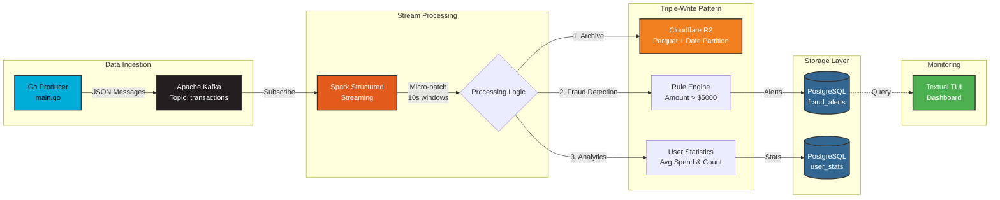

# 🛡️ Sentinel: Real-Time Fraud Detection Engine


> A distributed stream processing system for real-time financial fraud detection with cloud-native data archiving using Apache Kafka, Spark Structured Streaming, and Cloudflare R2.

## 📋 Table of Contents
- [Overview](#-overview)
- [Architecture](#-architecture)
- [Features](#-features)
- [Tech Stack](#-tech-stack)
- [Project Structure](#-project-structure)
- [Getting Started](#-getting-started)
- [How It Works](#-how-it-works)
- [Monitoring](#-monitoring)
- [Data Lake Architecture](#-data-lake-architecture)
- [Makefile Commands](#-makefile-commands)
- [Performance Metrics](#-performance-metrics)
- [Roadmap](#-roadmap)

## 🎯 Overview

Sentinel is a production-grade fraud detection system that processes high-velocity transaction streams in real-time. The system ingests transaction data from a Go-based producer, processes it through Spark Structured Streaming with 10-second micro-batches, and flags suspicious transactions using rule-based detection algorithms. All transactions are archived to Cloudflare R2 (S3-compatible object storage) in Parquet format with date partitioning, while alerts are persisted to PostgreSQL and visualized through a live terminal dashboard.

**Key Highlights:**
- Processes ~10 transactions/second with sub-second latency
- Rule-based fraud detection (threshold: $5,000)
- Distributed architecture with horizontal scalability
- Cloud-native data lake with Parquet archiving on R2
- Fault-tolerant streaming with checkpointing
- Real-time monitoring via TUI dashboard

## 🏗️ Architecture



## ✨ Features

### Core Functionality
- **Real-Time Stream Processing**: Kafka-backed event streaming with exactly-once semantics
- **Fraud Detection Engine**: Rule-based anomaly detection for suspicious transactions
- **User Behavior Analytics**: Windowed aggregations for per-user spending patterns
- **Cloud Data Lake**: Automated Parquet archiving to Cloudflare R2 with date partitioning
- **Live Monitoring Dashboard**: Terminal-based UI with auto-refresh (2-second intervals)

### Technical Features
- **Distributed Processing**: Spark master-worker cluster for horizontal scaling
- **Fault Tolerance**: Kafka offset management with Spark checkpointing
- **Triple-Write Architecture**: Simultaneous writes to R2, fraud_alerts, and user_stats tables
- **S3-Compatible Storage**: Leverages Cloudflare R2 for cost-effective object storage
- **Containerized Deployment**: Docker Compose orchestration for all services
- **Data Partitioning**: Date-based partitioning for efficient historical queries

## 🛠️ Tech Stack

| Component | Technology | Purpose |
|-----------|-----------|---------|
| **Message Broker** | Apache Kafka 7.5.0 | Event streaming and buffering |
| **Stream Processing** | Apache Spark 3.5.0 | Structured streaming and micro-batch processing |
| **Producer** | Go 1.21+ | High-performance transaction generation |
| **Database** | PostgreSQL 15 | Alert storage and analytics |
| **Data Lake** | Cloudflare R2 | Cold storage with Parquet columnar format |
| **Storage Format** | Apache Parquet | Efficient columnar storage with compression |
| **Caching** | Redis Alpine | Future: Session management |
| **Monitoring** | Textual (Python) | Real-time TUI dashboard |
| **Orchestration** | Docker Compose | Service containerization |

## 📁 Project Structure

```
sentinel/
│
├── src/
│   ├── producer/
│   │   └── main.go              # Transaction generator (Kafka producer)
│   │
│   ├── processor/
│   │   └── job.py               # Spark Structured Streaming job with R2 archiving
│   │
│   └── dashboard/
│       └── app.py               # Textual TUI for monitoring
│
├── deploy/
│   └── docker/
│       ├── docker-compose.yml   # Multi-container orchestration
│       └── .env                 # R2 credentials (create this)
│
├── Makefile                     # Automation commands
└── README.md
```

## 🚀 Getting Started

### Prerequisites
```bash
# Required
- Docker & Docker Compose
- Go 1.21+
- Python 3.9+
- Cloudflare R2 account (free tier available)

# Optional (for local development)
- Java 11+ (for Spark)
- PostgreSQL client
```

### Installation

#### 1. **Clone the repository**
```bash
git clone https://github.com/yourusername/sentinel.git
cd sentinel
```

#### 2. **Configure Cloudflare R2 credentials**

Create a `.env` file at `deploy/docker/.env`:

```bash
# Get these from Cloudflare Dashboard → R2 → Manage R2 API Tokens
AWS_ACCESS_KEY_ID=your_r2_access_key_id
AWS_SECRET_ACCESS_KEY=your_r2_secret_access_key
S3_ENDPOINT=https://your_account_id.r2.cloudflarestorage.com
```

**How to get R2 credentials:**
1. Log into Cloudflare Dashboard
2. Navigate to **R2 Object Storage**
3. Click **Manage R2 API Tokens**
4. Create a new API token with read/write permissions
5. Create a bucket named `sentinel`
6. Copy your Account ID to construct the endpoint URL

#### 3. **Verify credentials**
```bash
make env-check
```

#### 4. **Start the infrastructure**
```bash
make up
```

This automatically:
- Starts Zookeeper, Kafka, Spark (master + worker), PostgreSQL, and Redis
- Waits 15 seconds for Kafka to initialize
- Creates the `transactions` topic

#### 5. **Initialize the database**
```bash
make db-init
```

This creates:
- `fraud_alerts` table (transaction_id, user_id, amount, timestamp)
- `user_stats` table (user_id, avg_spend, txn_count, updated_at)

#### 6. **Submit the Spark streaming job**
```bash
make submit
```

Watch for log messages:
```
✅ Spark Session created successfully
✅ Kafka stream connected
✅ Streaming query started (checkpoint: /tmp/spark-checkpoints/sentinel-fraud-detection)
```

#### 7. **Start the transaction producer** (new terminal)
```bash
make producer
```

You should see:
```
🚀 Starting Transaction Generator...
✅ Sent: User 42 | Amount $67.89
⚠️ INJECTING FRAUDULENT PATTERN
✅ Sent: User 15 | Amount $6789.00
```

#### 8. **Launch the monitoring dashboard** (new terminal)
```bash
make dashboard
```

Press `r` to force refresh, `q` to quit.

## ⚙️ How It Works

### 1. Transaction Generation
The Go producer (`main.go`) generates synthetic transaction data:
- **Normal transactions**: $0.00 - $100.00 (Users 1-100)
- **Fraudulent patterns**: Injected every 50th transaction (amount × 100)
- **Throughput**: 10 transactions/second
- **Kafka partitioning**: By `user_id` for ordered processing

### 2. Stream Processing Pipeline

```python
# Spark job processes data in 4 stages:

1. Kafka Ingestion
   - Reads from 'transactions' topic
   - Deserializes JSON messages
   - Converts timestamp strings to proper timestamp types

2. Data Lake Archiving (NEW!)
   - Writes all transactions to R2 in Parquet format
   - Partitions by date (YYYY-MM-DD) for efficient queries
   - Path: s3a://sentinel/raw_transactions/date=2024-11-29/*.parquet
   - Compressed columnar storage with Snappy codec

3. Fraud Detection
   - Filters transactions > $5,000
   - Writes alerts to fraud_alerts table
   - Logs warnings for suspicious activity

4. User Analytics
   - Groups by user_id within 10s windows
   - Calculates avg_spend and txn_count
   - Writes stats to user_stats table
```

### 3. Fault Tolerance

Spark Structured Streaming uses **checkpointing** to ensure exactly-once processing:
- Checkpoint location: `/tmp/spark-checkpoints/sentinel-fraud-detection`
- Stores Kafka offsets and processing state
- Automatic recovery on failure
- Persisted to Docker volume `spark-checkpoints`

### 4. Monitoring Dashboard
The Textual TUI (`app.py`) provides:
- Live feed of fraudulent transactions (refreshes every 2s)
- Transaction ID, User ID, Amount, and Timestamp
- Color-coded alerts (red headers, green borders)
- Keyboard shortcuts: `r` to force refresh, `q` to quit

## 📊 Monitoring

### Access Spark UI
```bash
make spark-ui
# Or manually: http://localhost:8080
```
View job status, executors, streaming metrics, and checkpoint progress.

### Query PostgreSQL Directly
```bash
make db-shell

-- View recent fraud alerts
SELECT * FROM fraud_alerts ORDER BY timestamp DESC LIMIT 10;

-- Check user statistics
SELECT user_id, avg_spend, txn_count FROM user_stats ORDER BY avg_spend DESC LIMIT 10;

-- Count total fraud alerts
SELECT COUNT(*) as total_frauds, SUM(amount) as total_fraud_amount FROM fraud_alerts;
```

### Kafka Topic Monitoring
```bash
# Check topic details
make kafka-consume

# Or manually check topic metadata
docker exec -it sentinel-kafka kafka-topics --describe --topic transactions --bootstrap-server localhost:9092
```

### Container Status
```bash
make status
```

## 🗄️ Data Lake Architecture

### R2 Storage Structure

```
s3a://sentinel/
└── raw_transactions/
    ├── date=2024-11-29/
    │   ├── part-00000-xxx.snappy.parquet
    │   ├── part-00001-xxx.snappy.parquet
    │   └── ...
    ├── date=2024-11-30/
    │   └── part-00000-xxx.snappy.parquet
    └── date=2024-12-01/
        └── ...
```

### Benefits of Parquet + R2

| Feature | Benefit |
|---------|---------|
| **Columnar Format** | 10-100x faster analytical queries |
| **Compression** | Snappy codec reduces storage by 60-80% |
| **Date Partitioning** | Skip entire days when querying specific dates |
| **Schema Evolution** | Add columns without rewriting existing data |
| **Cost** | R2 has zero egress fees (vs S3's $0.09/GB) |

### Querying Archived Data

You can query the Parquet files using Spark, AWS Athena, or DuckDB:

```python
# Example: Load historical data for analysis
df = spark.read.parquet("s3a://sentinel/raw_transactions/date=2024-11-29")
df.groupBy("user_id").agg({"amount": "sum"}).show()
```

## 🎮 Makefile Commands

| Command | Description |
|---------|-------------|
| `make help` | Show all available commands |
| `make up` | Start all infrastructure (auto-creates topic) |
| `make down` | Stop all containers |
| `make restart` | Full restart (down + up) |
| `make logs` | Follow Docker logs |
| `make topic` | Create Kafka topic manually |
| `make db-init` | Initialize PostgreSQL schema |
| `make db-shell` | Open PostgreSQL shell |
| `make submit` | Submit Spark job with R2 credentials |
| `make producer` | Run Go transaction generator |
| `make dashboard` | Launch monitoring TUI |
| `make spark-ui` | Open Spark Master UI in browser |
| `make kafka-consume` | Debug Kafka messages |
| `make status` | Show container status |
| `make env-check` | Verify R2 credentials are set |
| `make clean` | Remove all containers and volumes |
| `make clean-checkpoints` | Clear Spark checkpoints for fresh start |

## 📈 Performance Metrics

| Metric | Value |
|--------|-------|
| **Throughput** | ~10 transactions/sec (configurable) |
| **Processing Latency** | <500ms (p95) |
| **Batch Interval** | 10 seconds |
| **Fraud Detection Rate** | ~2% (1 in 50 transactions) |
| **Data Retention** | Unlimited (PostgreSQL + R2) |
| **Storage Format** | Parquet (Snappy compression) |
| **Partition Strategy** | Daily (by timestamp) |
| **Checkpoint Interval** | Per micro-batch (10s) |

## 🗺️ Roadmap

### Phase 1: Core System ✅
- [x] Kafka message broker setup
- [x] Go-based transaction producer
- [x] Spark Structured Streaming job
- [x] PostgreSQL integration
- [x] Real-time TUI dashboard
- [x] **Parquet Data Lake on R2 with date partitioning**
- [x] **Fault-tolerant checkpointing**

### Phase 2: Enhanced Analytics (In Progress)
- [ ] Machine learning model integration (Isolation Forest for anomaly detection)
- [ ] Sliding window aggregations (1-hour, 24-hour spending patterns)
- [ ] Redis integration for session-based fraud detection
- [ ] Real-time feature engineering pipeline
- [ ] Historical fraud pattern analysis using R2 archives

### Phase 3: Production Readiness
- [ ] Kubernetes deployment manifests (Helm charts)
- [ ] Prometheus metrics and Grafana dashboards
- [ ] Alert notifications (Slack/Email/PagerDuty)
- [ ] API layer for external integrations (REST + GraphQL)
- [ ] Comprehensive unit and integration tests
- [ ] CI/CD pipeline with GitHub Actions
- [ ] Multi-region R2 replication
- [ ] Data retention policies and lifecycle management

### Phase 4: Advanced Features
- [ ] Graph-based fraud detection (transaction networks)
- [ ] Real-time model scoring with MLflow
- [ ] A/B testing framework for detection rules
- [ ] Customer 360 view aggregation
- [ ] Regulatory compliance reporting (PCI-DSS, SOC 2)

## 🔧 Troubleshooting

### Spark Job Fails with S3 Errors
```bash
# Verify R2 credentials
make env-check

# Check if bucket exists in Cloudflare dashboard
# Ensure endpoint URL format: https://<account_id>.r2.cloudflarestorage.com
```

### Kafka Connection Refused
```bash
# Wait longer for Kafka to start
make down && sleep 5 && make up
```

### Dashboard Shows No Data
```bash
# Verify producer is running and Spark job is processing
make status
make logs

# Check if fraud_alerts table has data
make db-shell
SELECT COUNT(*) FROM fraud_alerts;
```

### Clear Checkpoints for Fresh Start
```bash
make clean-checkpoints
make submit
```

## 🤝 Contributing

This is a personal project for learning purposes. However, suggestions and feedback are welcome! Feel free to open an issue or submit a pull request.

## 📝 License

This project is open source and available under the MIT License.

## 🙏 Acknowledgments

- Apache Kafka, Spark, and PostgreSQL communities
- Cloudflare for providing R2 object storage
- Textual framework for TUI development
- Inspired by real-world fraud detection systems at scale

---

**Built with ❤️ for learning distributed systems, stream processing, and cloud-native architectures**