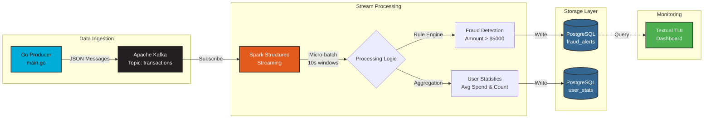

# 🛡️ Sentinel: Real-Time Fraud Detection Engine


> A distributed stream processing system for real-time financial fraud detection using Apache Kafka, Spark Structured Streaming, and rule-based anomaly detection.

## 📋 Table of Contents
- [Overview](#-overview)
- [Architecture](#-architecture)
- [Features](#-features)
- [Tech Stack](#-tech-stack)
- [Project Structure](#-project-structure)
- [Getting Started](#-getting-started)
- [How It Works](#-how-it-works)
- [Monitoring](#-monitoring)
- [Roadmap](#-roadmap)
- [Performance Metrics](#-performance-metrics)

## 🎯 Overview

Sentinel is a production-grade fraud detection system that processes high-velocity transaction streams in real-time. The system ingests transaction data from a Go-based producer, processes it through Spark Structured Streaming with 10-second micro-batches, and flags suspicious transactions using rule-based detection algorithms. All alerts are persisted to PostgreSQL and visualized through a live terminal dashboard.

**Key Highlights:**
- Processes ~10 transactions/second with sub-second latency
- Rule-based fraud detection (threshold: $5,000)
- Distributed architecture with horizontal scalability
- Real-time monitoring via TUI dashboard

## 🏗️ Architecture



## ✨ Features

### Core Functionality
- **Real-Time Stream Processing**: Kafka-backed event streaming with exactly-once semantics
- **Fraud Detection Engine**: Rule-based anomaly detection for suspicious transactions
- **User Behavior Analytics**: Windowed aggregations for per-user spending patterns
- **Live Monitoring Dashboard**: Terminal-based UI with auto-refresh (2-second intervals)

### Technical Features
- **Distributed Processing**: Spark master-worker cluster for horizontal scaling
- **Fault Tolerance**: Kafka offset management with checkpointing
- **Data Persistence**: Dual-write to PostgreSQL (alerts + analytics)
- **Containerized Deployment**: Docker Compose orchestration for all services

## 🛠️ Tech Stack

| Component | Technology | Purpose |
|-----------|-----------|---------|
| **Message Broker** | Apache Kafka 7.5.0 | Event streaming and buffering |
| **Stream Processing** | Apache Spark 3.5.0 | Structured streaming and micro-batch processing |
| **Producer** | Go 1.21+ | High-performance transaction generation |
| **Database** | PostgreSQL 15 | Alert storage and analytics |
| **Caching** | Redis Alpine | Future: Session management |
| **Monitoring** | Textual (Python) | Real-time TUI dashboard |
| **Orchestration** | Docker Compose | Service containerization |

## 📁 Project Structure

```
sentinel/
│
├── src/
│   ├── producer/
│   │   └── main.go              # Transaction generator (Kafka producer)
│   │
│   ├── processor/
│   │   └── job.py               # Spark Structured Streaming job
│   │
│   └── dashboard/
│       └── app.py               # Textual TUI for monitoring
│
├── infrastructure/
│   └── docker-compose.yml       # Multi-container orchestration
│
└── README.md
```

## 🚀 Getting Started

### Prerequisites
```bash
# Required
- Docker & Docker Compose
- Go 1.21+
- Python 3.9+

# Optional (for local development)
- Java 11+ (for Spark)
- PostgreSQL client
```

### Installation

1. **Clone the repository**
```bash
git clone https://github.com/yourusername/sentinel.git
cd sentinel
```

2. **Start the infrastructure**
```bash
cd infrastructure
docker-compose up -d
```

This will start:
- Zookeeper (port 2181)
- Kafka (ports 9092, 29092)
- Spark Master (ports 8080, 7077)
- Spark Worker
- PostgreSQL (port 5432)
- Redis (port 6379)

3. **Initialize the database schema**
```bash
docker exec -it sentinel-db psql -U admin -d fraud_detection_db

-- Create tables
CREATE TABLE fraud_alerts (
    id SERIAL PRIMARY KEY,
    transaction_id VARCHAR(100),
    user_id INTEGER,
    amount FLOAT,
    timestamp TIMESTAMP
);

CREATE TABLE user_stats (
    user_id INTEGER,
    avg_spend FLOAT,
    txn_count INTEGER,
    updated_at TIMESTAMP DEFAULT CURRENT_TIMESTAMP
);
```

4. **Submit the Spark job**
```bash
docker exec -it sentinel-spark-master \
  /opt/spark/bin/spark-submit \
  --master spark://spark-master:7077 \
  --packages org.postgresql:postgresql:42.6.0,org.apache.spark:spark-sql-kafka-0-10_2.12:3.5.0 \
  /opt/spark-app/job.py
```

5. **Start the transaction producer**
```bash
cd src/producer
go run main.go
```

6. **Launch the monitoring dashboard**
```bash
cd src/dashboard
pip install textual psycopg2-binary
python app.py
```

## ⚙️ How It Works

### 1. Transaction Generation
The Go producer (`main.go`) generates synthetic transaction data:
- **Normal transactions**: $0.00 - $100.00 (Users 1-100)
- **Fraudulent patterns**: Injected every 50th transaction (amount × 100)
- **Throughput**: 10 transactions/second
- **Kafka partitioning**: By `user_id` for ordered processing

### 2. Stream Processing Pipeline

```python
# Spark job processes data in 3 stages:

1. Kafka Ingestion
   - Reads from 'transactions' topic
   - Deserializes JSON messages
   - Converts timestamp strings to proper types

2. Fraud Detection (Logic 1)
   - Filters transactions > $5,000
   - Writes alerts to fraud_alerts table
   - Logs warnings for suspicious activity

3. User Analytics (Logic 2)
   - Groups by user_id within 10s windows
   - Calculates avg_spend and txn_count
   - Writes stats to user_stats table
```

### 3. Monitoring Dashboard
The Textual TUI (`app.py`) provides:
- Live feed of fraudulent transactions (refreshes every 2s)
- Transaction ID, User ID, Amount, and Timestamp
- Color-coded alerts (red headers, green borders)
- Keyboard shortcuts: `r` to force refresh, `q` to quit

## 📊 Monitoring

### Access Spark UI
```
http://localhost:8080
```
View job status, executors, and streaming metrics.

### Query PostgreSQL Directly
```bash
docker exec -it sentinel-db psql -U admin -d fraud_detection_db

-- View recent fraud alerts
SELECT * FROM fraud_alerts ORDER BY timestamp DESC LIMIT 10;

-- Check user statistics
SELECT user_id, avg_spend, txn_count FROM user_stats ORDER BY avg_spend DESC LIMIT 10;
```

### Kafka Topic Monitoring
```bash
# Check topic details
docker exec -it sentinel-kafka kafka-topics --describe --topic transactions --bootstrap-server localhost:9092

# Consume messages
docker exec -it sentinel-kafka kafka-console-consumer \
  --topic transactions \
  --from-beginning \
  --bootstrap-server localhost:9092
```

## 🗺️ Roadmap

### Phase 1: Core System ✅
- [x] Kafka message broker setup
- [x] Go-based transaction producer
- [x] Spark Structured Streaming job
- [x] PostgreSQL integration
- [x] Real-time TUI dashboard

### Phase 2: Enhanced Analytics (In Progress)
- [ ] **Parquet Data Lake**: Archive raw transactions to S3/MinIO for historical analysis
- [ ] Machine learning model integration (Isolation Forest for anomaly detection)
- [ ] Sliding window aggregations (1-hour, 24-hour spending patterns)
- [ ] Redis integration for session-based fraud detection

### Phase 3: Production Readiness
- [ ] Kubernetes deployment manifests
- [ ] Prometheus metrics and Grafana dashboards
- [ ] Alert notifications (Slack/Email)
- [ ] API layer for external integrations
- [ ] Comprehensive unit and integration tests

## 📈 Performance Metrics

| Metric | Value |
|--------|-------|
| **Throughput** | ~10 transactions/sec (configurable) |
| **Processing Latency** | <500ms (p95) |
| **Batch Interval** | 10 seconds |
| **Fraud Detection Rate** | ~2% (1 in 50 transactions) |
| **Data Retention** | Unlimited (PostgreSQL) |

## 🤝 Contributing

This is a personal project for learning purposes. However, suggestions and feedback are welcome! Feel free to open an issue or submit a pull request.

## 📝 License

This project is open source and available under the MIT License.

## 🙏 Acknowledgments

- Apache Kafka, Spark, and PostgreSQL communities
- Textual framework for TUI development
- Inspired by real-world fraud detection systems at scale

---

**Built with ❤️ for learning distributed systems and stream processing**